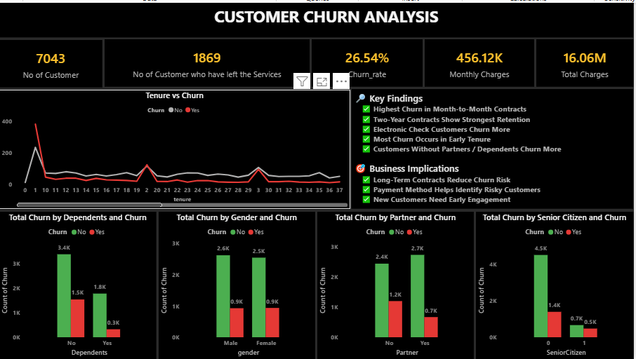

# 📊 Customer Churn & Retention Analysis

An interactive Power BI report designed to analyze customer churn behavior and identify the primary factors influencing customer attrition and retention. The dashboard focuses on churn trends, contract behavior, tenure dynamics, and payment risk indicators.

---

## 🧭 Report Structure

### **Customer Churn Overview**
High-level summary of churn metrics, customer distribution, and overall churn patterns.

---

### **Churn Drivers & Patterns**
Detailed exploration of churn contributors including contract type, tenure, and payment methods.

---

## 🔎 Key Findings

- Highest churn observed among Month-to-Month customers  
- Long-term contracts demonstrate stronger retention behavior  
- Electronic Check customers exhibit higher churn risk  
- Churn concentrated within early customer tenure  

---

## 🎯 Business Implications

- Contract structure strongly influences customer stability  
- Payment behavior can serve as a churn risk signal  
- Early lifecycle retention strategies are critical  

---

## 🛠 Tools & Skills Demonstrated

- Power BI  
- DAX  
- Data Modeling  
- Data Analysis  
- Data Visualization  
- KPI Design  
- Business Insights  

---

## 🔗 Live Dashboard

Access the interactive Power BI report:

👉 [View Report on Power BI Service](https://app.powerbi.com/groups/me/reports/fa9eb86d-a748-45ac-9d00-dcc8071e86d7/ReportSection?experience=power-bi)

---

⭐ *This project is part of a practical analytics portfolio emphasizing business-driven insights and decision-focused dashboards.*
