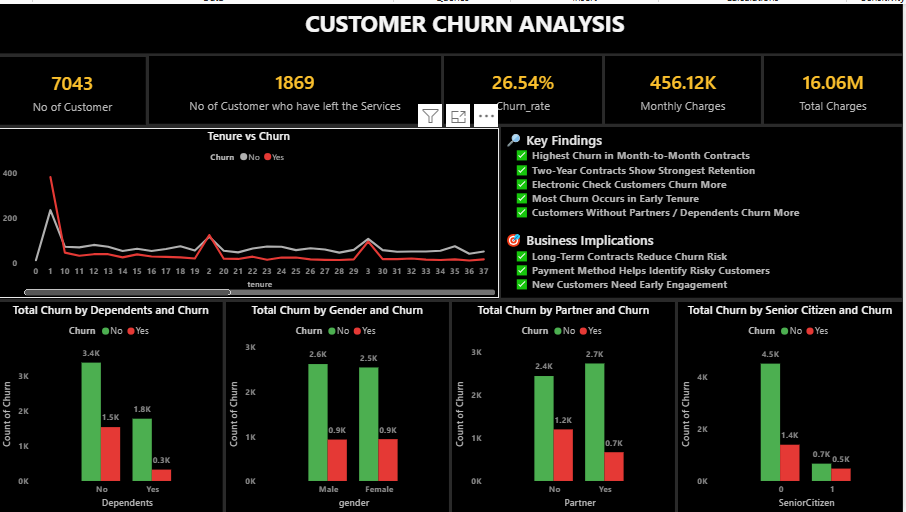
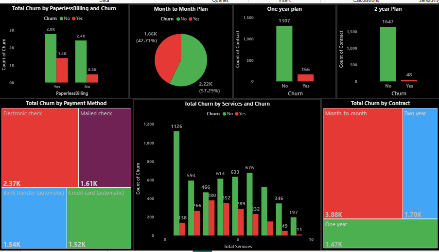

# 📊 Customer Churn & Retention Analysis

An interactive Power BI dashboard built to analyze customer churn behavior and identify the primary factors influencing customer attrition and retention. The report highlights churn patterns, contract dynamics, tenure trends, and payment-related risk signals.

---

## 🧭 Report Pages

### Customer Churn Overview
High-level summary of churn metrics, customer distribution, and overall trends.

---

### Churn Drivers & Patterns
Detailed analysis of key churn contributors including contract type, tenure, and payment method.

---

## 🔎 Key Findings

- Churn is highest among Month-to-Month customers  
- Long-term contracts show stronger retention behavior  
- Electronic Check customers present elevated churn risk  
- Churn is concentrated within early tenure customers  

---

## 🛠 Tools & Skills Demonstrated

- Power BI  
- DAX  
- Data Modeling  
- Data Visualization  
- KPI Design  
- Business Insights  

---

## 🔗 Live Dashboard

👉 [View Report on Power BI Service](https://app.powerbi.com/view?r=eyJrIjoiNzczNmQzMmQtMzJmZS00YmNlLWEwOWUtOGNkOThhMWI0NzdlIiwidCI6IjNiY2YzZjA3LWFkMDAtNDlkMC1iOTNiLWI3ZWQ0MDA1MzI3NyJ9)

---

⭐ This project focuses on business-driven analytics and decision-oriented dashboard design.
